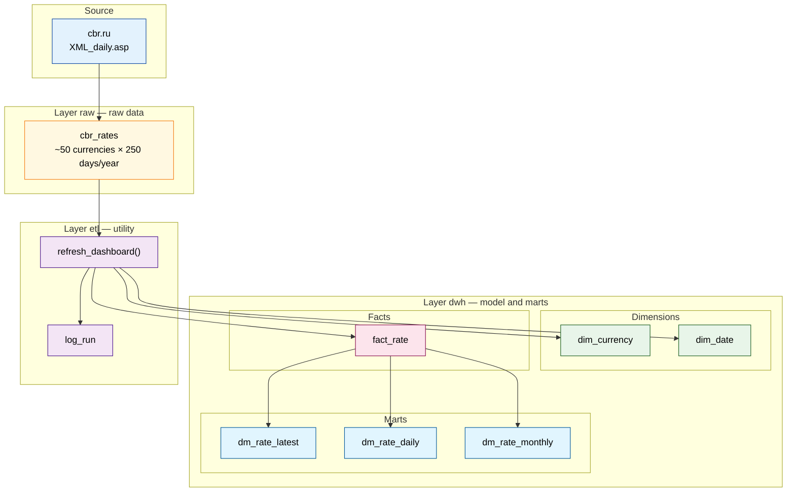
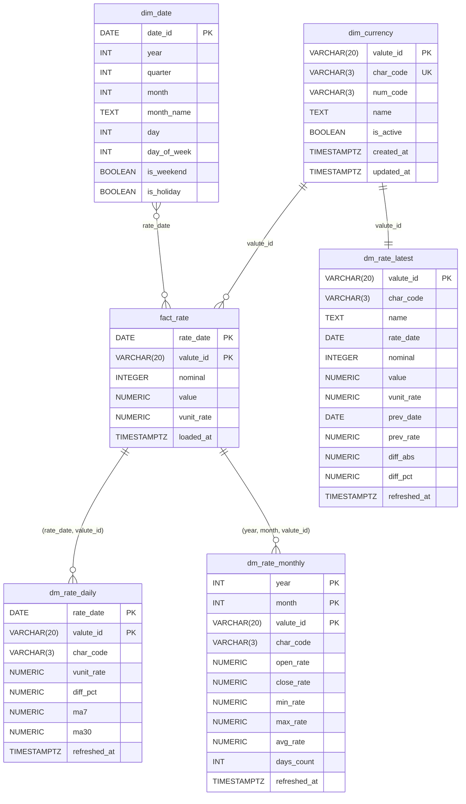
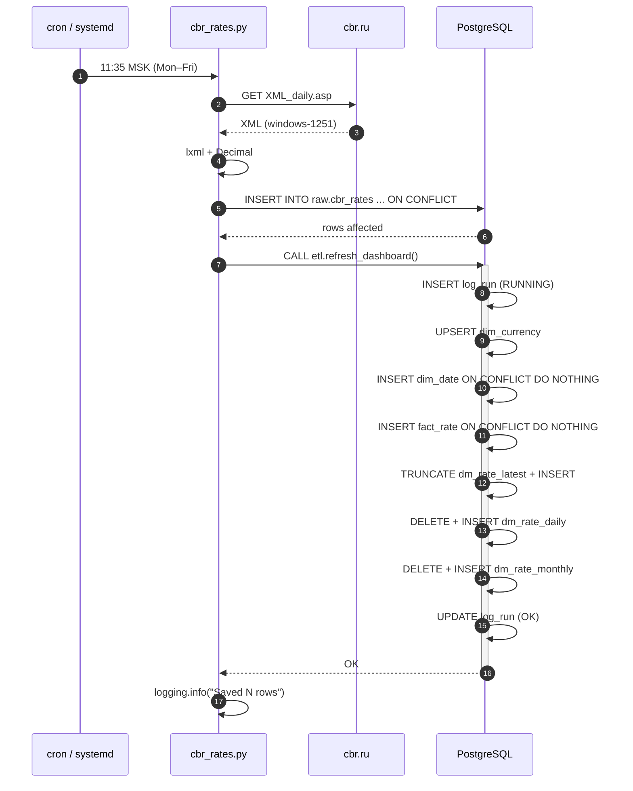

# CBR Rates ETL

[](./README.md)
[](./README.ru.md)

---

[](https://www.python.org/)
[](https://www.postgresql.org/)
[](#license)

An ETL pipeline that pulls official currency exchange rates from [cbr.ru](https://www.cbr.ru/scripts/XML_daily.asp) (Bank of Russia) into PostgreSQL on a daily basis and builds data marts for a BI dashboard.

---

## Table of Contents

- [About the Project](#about-the-project)
    - [Business Problem](#business-problem)
    - [What the Project Does](#what-the-project-does)
    - [Who Needs It and Why](#who-needs-it-and-why)
- [Key Principles](#key-principles)
- [Architecture](#architecture)
- [How the ETL Process Works](#how-the-etl-process-works)
    - [Extract — Fetching Data](#extract--fetching-data)
    - [Transform — Converting Data](#transform--converting-data)
    - [Load — Storing Data](#load--storing-data)
    - [Building Marts](#building-marts)
- [Data Layers](#data-layers)
- [Data Model](#data-model)
- [Data Flow](#data-flow)
- [Repository Structure](#repository-structure)
- [Requirements](#requirements)
- [Installation](#installation)
- [Database Setup](#database-setup)
- [Running](#running)
- [Example Queries](#example-queries)
- [Monitoring](#monitoring)
- [Automation](#automation)
- [Failure Handling](#failure-handling)
- [Roadmap](#roadmap)
- [License](#license)
- [Autor](#Contacts)

---

## About the Project

### Business Problem

The company deals with foreign-currency operations and regularly reconciles against the **official exchange rates published by the Bank of Russia**. The rates are published on cbr.ru as an XML dump called `XML_daily.asp`, refreshed once per business day. This dump is a "raw" format: a single large XML blob where each currency is a `<Valute>` tag, numbers come with a decimal comma, and the encoding is windows-1251.

Analysts and product teams need a **stable, historical, normalized data source** they can build a dashboard on: cards with "current rate", line charts of dynamics, monthly aggregates. Pulling XML directly into a dashboard is not an option — it's slow, unreliable, has no history, no aggregates, and no access control.

### What the Project Does

The ETL pipeline solves this end to end:

1. **Fetches** the XML from cbr.ru on a schedule.
2. **Parses** it into a structured form (encoding, decimal comma, nested tags).
3. **Stores raw data** in PostgreSQL without loss and without duplicates.
4. **Normalizes**: a currency dimension, a calendar dimension, a rate fact table.
5. **Builds marts** for the dashboard: latest rates, daily dynamics with MA7/MA30, monthly candles.
6. **Logs** every run: status, timing, affected rows, errors.

### Who Needs It and Why

| Role | What they get |
|---|---|
| **Analyst / BI** | Ready-to-use `dm_*` marts with rates, deltas, and moving averages. Connects via a read-only role. |
| **Dashboard developer** | Stable tables with a fixed schema, decoupled from the CBR XML format. |
| **Data engineer** | A transparent ETL: `raw → dwh → dm`, a run log, idempotency. |
| **DBA** | Clear access separation: `cbr_loader` writes, `bi_reader` reads, `public` is not used as a workspace. |

---

## Key Principles

The project is built on a handful of foundational principles that explain most of the code decisions.

### 1. Idempotency

**A repeated run must not corrupt data.** If the script fails and is restarted, or if cron accidentally fires twice, the result must be the same.

- In `raw.cbr_rates` — `ON CONFLICT (record_date, rate_date, valute_id) DO UPDATE`. Re-inserting the same day's data updates the row instead of duplicating it.
- In `dwh.fact_rate` — `ON CONFLICT (rate_date, valute_id) DO NOTHING`. Historical facts are never overwritten.
- Marts `dm_*` are rebuilt from `fact_rate`, so they are always consistent with the fact table.

### 2. Layering (raw / dwh / etl)

**Raw data and the business model are different things.** The CBR XML format may change — new fields, different encoding. If business logic sits directly on the raw data, any source change breaks everything.

- `raw` — "as it came from the source". Minimal transformation, maximum fidelity.
- `dwh` — the normalized model: dimensions, facts, marts. Business logic lives here.
- `etl` — the utility layer: procedures, logs.

Between layers — only through explicit schema names (`raw.cbr_rates`, `dwh.fact_rate`). This means the ETL procedure won't break if someone changes `search_path` in their session.

### 3. Precision over Speed

Exchange rates are money. An error of 0.0001 RUB can accumulate across a report. Therefore:

- Numbers are parsed into `Decimal`, not `float`. `float` loses precision on decimal fractions.
- In the DB, `NUMERIC(20,6)` is used for `value` and `NUMERIC(20,8)` for `vunit_rate` — plenty of headroom for any rate.
- When parsing XML, the decimal comma `,` is replaced with a dot `.` before conversion.

### 4. Transparency and Observability

**If the ETL fails, it must be visible.** Every run writes a row to `etl.log_run`:

- `status = RUNNING` at the start,
- `status = OK` or `status = ERROR` at the end,
- `rows_affected` — JSONB with affected row counts per step,
- `error_msg` — error text if something went wrong.

Plus Python-side `logging`: the same status is duplicated to stdout / a log file.

### 5. Access Separation

The loader and BI should not connect as the same role. `cbr_loader` writes to `raw` and calls the ETL. `bi_reader` only has SELECT on the marts. The `public` schema is not used as a workspace at all.

---

## Architecture

The project is three layers in one database, with data flowing in one direction.

```bash
flowchart LR
    API["cbr.ru<br/>XML_daily.asp"] -->|requests + lxml| PY["Python loader<br/>cbr_rates.py"]
    PY -->|UPSERT| RAW[("raw.cbr_rates")]
    PY -->|CALL| ETL["etl.refresh_dashboard()"]
    ETL -->|reads| RAW
    ETL -->|writes| DIM[("dwh.dim_currency<br/>dwh.dim_date")]
    ETL -->|writes| FACT[("dwh.fact_rate")]
    FACT --> DM1[("dwh.dm_rate_latest")]
    FACT --> DM2[("dwh.dm_rate_daily")]
    FACT --> DM3[("dwh.dm_rate_monthly")]
    ETL -->|writes| LOG[("etl.log_run")]
    DM1 --> BI["BI / Dashboard"]
    DM2 --> BI
    DM3 --> BI

    classDef src fill:#e3f2fd,stroke:#0d47a1,color:#000
    classDef store fill:#fff3e0,stroke:#e65100,color:#000
    classDef etl fill:#f3e5f5,stroke:#4a148c,color:#000
    classDef bi fill:#e8f5e9,stroke:#1b5e20,color:#000
    class API,PY src
    class RAW,DIM,FACT,DM1,DM2,DM3,LOG store
    class ETL etl
    class BI bi
```

**How to read it:**

- The Python loader is the only component that goes outside (to cbr.ru).
- Raw data lands in `raw.cbr_rates`. Nothing else touches it except the ETL procedure.
- The ETL procedure is the heart of the project. It reads `raw`, writes to `dwh`, updates the marts, and logs.
- The BI layer reads only `dm_*` and `dim_*`. It has no access to `raw`.

---

## How the ETL Process Works

ETL stands for Extract, Transform, Load. In our case there's a fourth step: building the marts. Let's break down each.

### Extract — Fetching Data

**Source:** `https://www.cbr.ru/scripts/XML_daily.asp`

**What it is:** an XML document in windows-1251 encoding, refreshed by the Bank of Russia once per business day (usually mid-day). Structure:

```bash
```xml
<ValCurs Date="12.09.2026" name="Foreign Currency Market">
  <Valute ID="R01010">
    <NumCode>036</NumCode>
    <CharCode>AUD</CharCode>
    <Nominal>1</Nominal>
    <Name>Австралийский доллар</Name>
    <Value>60,4290</Value>
    <VunitRate>60,429</VunitRate>
  </Valute>
  ...
</ValCurs>
```
```
```
```
*****Source quirks:**
```
| Quirk | How we handle it |
|---|---|
| windows-1251 encoding | `lxml` reads the XML declaration and decodes to Unicode |
| Decimal comma `60,4290` | `Decimal("60,4290".replace(",", "."))` |
| Non-breaking spaces in numbers | `.replace("\xa0", "")` |
| Rate date in the `ValCurs/@Date` attribute | `datetime.strptime(..., "%d.%m.%Y")` |
| Multiple `<Valute>` tags in sequence | `root.findall("Valute")` |

**Code:**

```bash
```python
def fetch_xml(url: str = URL) -> bytes:
    resp = requests.get(url, timeout=30)
    resp.raise_for_status()
    return resp.content
```
```

`resp.content` (bytes), not `resp.text` — so we don't rely on HTTP headers, which have historically been wrong on cbr.ru. `lxml` figures out the encoding from the XML declaration itself.

### Transform — Converting Data

At this step, XML is turned into a list of Python dicts ready for DB insertion.

**What we do:**

1. **Parse the XML** with `recover=True` — if the document has minor issues, the parser survives them instead of crashing.
2. **Extract the rate date** from the `ValCurs/@Date` attribute — this is the rate's date, not the run date (they can differ if we run later).
3. **Normalize numbers** — comma → dot, strip spaces, convert to `Decimal`.
4. **Build a list of dicts** — one per currency.

**Code:**

```bash
```python
def parse_rates(xml_bytes: bytes):
    parser = etree.XMLParser(recover=True, resolve_entities=False, no_network=True)
    root = etree.fromstring(xml_bytes, parser=parser)

    date_attr = root.get("Date")
    rate_date = datetime.strptime(date_attr, "%d.%m.%Y").date()

    def text(el, tag):
        node = el.find(tag)
        return node.text.strip() if node is not None and node.text else None

    def to_decimal(s):
        return Decimal(s.replace(",", ".").replace("\xa0", "").strip()) if s else None

    rates = []
    for v in root.findall("Valute"):
        rates.append({
            "valute_id":  v.get("ID"),
            "num_code":   text(v, "NumCode"),
            "char_code":  text(v, "CharCode"),
            "nominal":    int(text(v, "Nominal") or 1),
            "name":       text(v, "Name"),
            "value":      to_decimal(text(v, "Value")),
            "vunit_rate": to_decimal(text(v, "VunitRate")),
        })
    return rate_date, rates
```
```

**Important details:**

- `resolve_entities=False` and `no_network=True` — protection against XXE attacks and external entities. CBR's XML is unlikely to be hostile, but it's good hygiene.
- `Nominal` can be `1`, `100`, or `1000`. For DZD and AMD, for example, it's `100`. This affects the interpretation of `Value` — it's per `Nominal` units, not per one.
- `VunitRate` is already reduced to "per 1 unit". We use it for dynamics.
```
### Load — Storing Data

Raw data lands in `raw.cbr_rates`.

**Table schema:**

| Column | Type | Meaning |
|---|---|---|
| `id` | BIGSERIAL PK | Surrogate key |
| `record_date` | DATE NOT NULL | When we recorded it (run date) |
| `rate_date` | DATE NOT NULL | Rate date from `ValCurs/@Date` |
| `valute_id` | VARCHAR(20) NOT NULL | CBR internal ID, e.g. `R01010` |
| `num_code` | VARCHAR(3) | ISO numeric code, e.g. `036` |
| `char_code` | VARCHAR(3) NOT NULL | Alphabetic code, e.g. `AUD` |
| `nominal` | INTEGER NOT NULL | Nominal, `1` / `100` / `1000` |
| `name` | TEXT | Currency name |
| `value` | NUMERIC(20,6) | Rate per `nominal` units |
| `vunit_rate` | NUMERIC(20,8) | Rate per 1 unit |
| `created_at` | TIMESTAMPTZ | Insert timestamp |

**Why two dates:** `record_date` is the "load date", `rate_date` is the "rate date". If we run the script on Monday morning and the CBR hasn't refreshed the Monday rate yet, we'll get Friday's. Both dates must be stored separately to:

- See when exactly we received this row.
- Distinguish "the rate for today" from "the rate published today".
- Protect against re-insertion via `UNIQUE (record_date, rate_date, valute_id)`.

**Implementation — batched UPSERT:**

```bash
```python
INSERT_SQL = """
    INSERT INTO raw.cbr_rates
        (record_date, rate_date, valute_id, num_code, char_code,
         nominal, name, value, vunit_rate)
    VALUES %s
    ON CONFLICT (record_date, rate_date, valute_id) DO UPDATE SET
        num_code   = EXCLUDED.num_code,
        char_code  = EXCLUDED.char_code,
        nominal    = EXCLUDED.nominal,
        name       = EXCLUDED.name,
        value      = EXCLUDED.value,
        vunit_rate = EXCLUDED.vunit_rate
"""

with conn.cursor() as cur:
    execute_values(cur, INSERT_SQL, rows, page_size=500)
conn.commit()
```

`execute_values` assembles a single multi-row `INSERT` — many times faster than one `INSERT` per currency. `page_size=500` is the batch size; for ~50 currencies it's one page, for larger dumps there will be several.
```
### Building Marts

After loading raw data, the procedure `etl.refresh_dashboard()` is called. It performs 6 steps.

**1. `dim_currency` — currency dimension (SCD1).**

We take one row per currency from the raw data (`DISTINCT ON (valute_id)`) and update the name/codes if they changed. `ON CONFLICT DO UPDATE` — SCD1, storing only the current state.

```sql
INSERT INTO dwh.dim_currency (valute_id, char_code, num_code, name, updated_at)
SELECT DISTINCT ON (valute_id)
       valute_id, char_code, num_code, name, now()
FROM raw.cbr_rates
ORDER BY valute_id, rate_date DESC, record_date DESC
ON CONFLICT (valute_id) DO UPDATE
    SET char_code  = EXCLUDED.char_code,
        num_code   = EXCLUDED.num_code,
        name       = EXCLUDED.name,
        updated_at = now();
```

**2. `dim_date` — calendar.**

Filled from `p_calendar_from` (default: 3 years ago) to one year ahead. Contains year, quarter, month, day of week, weekend flag. `ON CONFLICT DO NOTHING` — if the date already exists, skip it.

**3. `fact_rate` — rate facts.**

From `raw.cbr_rates`, we take all rows, join with `dim_currency` (to discard unknown currencies), insert with `ON CONFLICT (rate_date, valute_id) DO NOTHING`. Historical rates are never overwritten.

```sql
INSERT INTO dwh.fact_rate
    (rate_date, valute_id, nominal, value, vunit_rate, loaded_at)
SELECT r.rate_date, r.valute_id, r.nominal, r.value, r.vunit_rate, now()
FROM raw.cbr_rates r
JOIN dwh.dim_currency c ON c.valute_id = r.valute_id
ON CONFLICT (rate_date, valute_id) DO NOTHING;
```

**4. `dm_rate_latest` — latest rate + delta.**

A mart for dashboard cards. For each currency, take the latest row and the previous one, and compute the difference in RUB and percent.

Logic using `ROW_NUMBER()`:

```sql
WITH ranked AS (
    SELECT f.rate_date, f.valute_id, f.vunit_rate,
           ROW_NUMBER() OVER (
               PARTITION BY f.valute_id ORDER BY f.rate_date DESC
           ) AS rn
    FROM dwh.fact_rate f
),
last_two AS (
    SELECT valute_id,
           MAX(CASE WHEN rn = 1 THEN rate_date  END) AS rate_date,
           MAX(CASE WHEN rn = 1 THEN vunit_rate END) AS vunit_rate,
           MAX(CASE WHEN rn = 2 THEN rate_date  END) AS prev_date,
           MAX(CASE WHEN rn = 2 THEN vunit_rate END) AS prev_rate
    FROM ranked
    WHERE rn <= 2
    GROUP BY valute_id
)
...
```

The mart is rebuilt via `TRUNCATE` — the table is tiny (~50 currencies), so rebuilding is cheaper than handling every possible change.

**5. `dm_rate_daily` — daily dynamics + MA7/MA30.**

For charts. Per currency and date — rate, percentage change, moving averages over 7 and 30 days. Default window is 90 days (`p_daily_days`).

`LAG()` gives the previous value, `AVG() OVER (... ROWS BETWEEN 6 PRECEDING AND CURRENT ROW)` — MA7. All in a single pass.

```sql
WITH base AS (
    SELECT f.rate_date, f.valute_id, c.char_code, f.vunit_rate,
           LAG(f.vunit_rate) OVER (
               PARTITION BY f.valute_id ORDER BY f.rate_date
           ) AS prev_rate
    FROM dwh.fact_rate f
    JOIN dwh.dim_currency c ON c.valute_id = f.valute_id
    WHERE f.rate_date >= CURRENT_DATE - (p_daily_days || ' days')::interval
),
with_ma AS (
    SELECT b.*,
           AVG(b.vunit_rate) OVER (
               PARTITION BY b.valute_id ORDER BY b.rate_date
               ROWS BETWEEN 6 PRECEDING AND CURRENT ROW
           ) AS ma7,
           AVG(b.vunit_rate) OVER (
               PARTITION BY b.valute_id ORDER BY b.rate_date
               ROWS BETWEEN 29 PRECEDING AND CURRENT ROW
           ) AS ma30
    FROM base b
)
...
```

**6. `dm_rate_monthly` — monthly candles (OHLC).**

For candlestick charts and monthly reports. Per currency and month: open, close, min, max, average, day count.

Open/close via `ARRAY_AGG` with sorting:

```sql
(ARRAY_AGG(vunit_rate ORDER BY rate_date ASC ))[1] AS open_rate,
(ARRAY_AGG(vunit_rate ORDER BY rate_date DESC))[1] AS close_rate
```

The first element of an array sorted by date ascending — the open. Sorted descending — the close.

**Logging.** At the procedure start — `INSERT INTO etl.log_run (..., status='RUNNING')`, at the end — `UPDATE ... status='OK'` with `rows_affected`. On exception — `UPDATE ... status='ERROR'` with `error_msg` and `RAISE`.

---

## Data Layers



**What lives in each layer:**

| Layer | Schema | Purpose | Who writes | Who reads |
|---|---|---|---|---|
| Raw | `raw` | Data as it came from the source | `cbr_loader` | ETL |
| Model | `dwh` (dim/fact) | Normalized dimensions and facts | ETL | ETL, analysts |
| Marts | `dwh` (dm_*) | Ready aggregates for BI | ETL | `bi_reader` |
| Utility | `etl` | Procedures, log | ETL | DBA, monitoring |

---

## Data Model



**Notes:**

- `dim_currency` — SCD1 (current state). Key — CBR's `valute_id` (`R01010`). `char_code` is unique.
- `dim_date` — a standard calendar. Needed for month/quarter aggregates without `EXTRACT` on large tables.
- `fact_rate` — composite key `(rate_date, valute_id)`. We store `nominal` because `value` is per `nominal` units, not per one.
- Marts `dm_*` — denormalized, no FKs, so BI queries are as simple as possible.

---

## Data Flow



---

## Repository Structure

```
cbr-rates-etl/
├── README.md
├── README.en.md
├── requirements.txt
├── requirements-dev.txt
├── .env.example
├── .gitignore
├── cbr_rates.py                  # main loader
├── sql/
│   ├── 00_prepare.sql
│   ├── 01_move_cbr_rates.sql
│   ├── 02_dwh_model.sql
│   ├── 03_dwh_marts.sql
│   ├── 04_etl.sql
│   ├── 05_run_and_check.sql
│   └── 06_grants.sql
└── scripts/
    └── cbr-rates.cron
```

---

## Requirements

| Component | Version |
|---|---|
| Python | 3.10+ |
| PostgreSQL | 13+ |
| `requests` | 2.31+ |
| `lxml` | 4.9+ |
| `psycopg2-binary` | 2.9+ |

`requirements.txt`:

```txt
requests>=2.31
lxml>=4.9
psycopg2-binary>=2.9
```

`requirements-dev.txt`:

```txt
lxml-stubs
types-requests
types-psycopg2
```

---

## Installation

```bash
git clone https://github.com/<user>/cbr-rates-etl.git
cd cbr-rates-etl

python -m venv .venv
source .venv/bin/activate          # Linux/macOS
.venv\Scripts\activate             # Windows

pip install -r requirements.txt
pip install -r requirements-dev.txt   # optional
```

Create `.env` (see `.env.example`):

```env
PGHOST=localhost
PGPORT=5432
PGDATABASE=coinlore
PGUSER=postgres
PGPASSWORD=change-me
```

---

## Database Setup

All scripts are idempotent — they can be re-applied safely. Order matters: `00 → 01 → 02 → 03 → 04 → 06`.

### Step 0. Schemas

`sql/00_prepare.sql`:

```sql
CREATE SCHEMA IF NOT EXISTS raw;
CREATE SCHEMA IF NOT EXISTS dwh;
CREATE SCHEMA IF NOT EXISTS etl;

COMMENT ON SCHEMA raw IS 'Raw data from external sources (CBR API, etc.)';
COMMENT ON SCHEMA dwh IS 'Normalized model + marts for the dashboard';
COMMENT ON SCHEMA etl IS 'ETL procedures and run log';
```

### Step 1. Move raw data to `raw`

`sql/01_move_cbr_rates.sql`:

```sql
ALTER TABLE public.cbr_rates SET SCHEMA raw;

COMMENT ON TABLE  raw.cbr_rates              IS 'Raw currency rates from cbr.ru (XML_daily.asp)';
COMMENT ON COLUMN raw.cbr_rates.record_date  IS 'Record date in DB (run date)';
COMMENT ON COLUMN raw.cbr_rates.rate_date    IS 'Rate date from ValCurs/@Date';
COMMENT ON COLUMN raw.cbr_rates.valute_id    IS 'CBR internal currency ID (R01010)';
COMMENT ON COLUMN raw.cbr_rates.num_code     IS 'ISO numeric code (036)';
COMMENT ON COLUMN raw.cbr_rates.char_code    IS 'ISO alphabetic code (AUD)';
COMMENT ON COLUMN raw.cbr_rates.nominal      IS 'Nominal (1, 100, 1000)';
COMMENT ON COLUMN raw.cbr_rates.name         IS 'Currency name';
COMMENT ON COLUMN raw.cbr_rates.value        IS 'Rate per nominal units';
COMMENT ON COLUMN raw.cbr_rates.vunit_rate   IS 'Rate per 1 unit';

CREATE INDEX IF NOT EXISTS idx_cbr_rates_rate_date  ON raw.cbr_rates (rate_date);
CREATE INDEX IF NOT EXISTS idx_cbr_rates_char_code  ON raw.cbr_rates (char_code);
```

If `public.cbr_rates` doesn't exist yet, create it like this:

```sql
CREATE TABLE public.cbr_rates (
    id            BIGSERIAL PRIMARY KEY,
    record_date   DATE        NOT NULL,
    rate_date     DATE        NOT NULL,
    valute_id     VARCHAR(20) NOT NULL,
    num_code      VARCHAR(3),
    char_code     VARCHAR(3)  NOT NULL,
    nominal       INTEGER     NOT NULL,
    name          TEXT,
    value         NUMERIC(20,6),
    vunit_rate    NUMERIC(20,8),
    created_at    TIMESTAMPTZ NOT NULL DEFAULT now(),
    CONSTRAINT uq_cbr_rates UNIQUE (record_date, rate_date, valute_id)
);
```

### Step 2. Normalized `dwh` model

`sql/02_dwh_model.sql`:

```sql
CREATE TABLE IF NOT EXISTS dwh.dim_currency (
    valute_id    VARCHAR(20) PRIMARY KEY,
    char_code    VARCHAR(3)  NOT NULL,
    num_code     VARCHAR(3),
    name         TEXT,
    is_active    BOOLEAN     NOT NULL DEFAULT TRUE,
    created_at   TIMESTAMPTZ NOT NULL DEFAULT now(),
    updated_at   TIMESTAMPTZ NOT NULL DEFAULT now()
);
CREATE UNIQUE INDEX IF NOT EXISTS uq_dim_currency_char_code
    ON dwh.dim_currency (char_code);
CREATE INDEX IF NOT EXISTS idx_dim_currency_num_code
    ON dwh.dim_currency (num_code);

CREATE TABLE IF NOT EXISTS dwh.dim_date (
    date_id      DATE PRIMARY KEY,
    year         INT  NOT NULL,
    quarter      INT  NOT NULL,
    month        INT  NOT NULL,
    month_name   TEXT NOT NULL,
    day          INT  NOT NULL,
    day_of_week  INT  NOT NULL,
    is_weekend   BOOLEAN NOT NULL,
    is_holiday   BOOLEAN NOT NULL DEFAULT FALSE
);
CREATE INDEX IF NOT EXISTS idx_dim_date_ym ON dwh.dim_date (year, month);

CREATE TABLE IF NOT EXISTS dwh.fact_rate (
    rate_date    DATE        NOT NULL,
    valute_id    VARCHAR(20) NOT NULL,
    nominal      INTEGER     NOT NULL,
    value        NUMERIC(20,6) NOT NULL,
    vunit_rate   NUMERIC(20,8) NOT NULL,
    loaded_at    TIMESTAMPTZ NOT NULL DEFAULT now(),
    PRIMARY KEY (rate_date, valute_id),
    CONSTRAINT fk_fact_rate_currency
        FOREIGN KEY (valute_id) REFERENCES dwh.dim_currency (valute_id)
);
CREATE INDEX IF NOT EXISTS idx_fact_rate_valute_date
    ON dwh.fact_rate (valute_id, rate_date DESC);
CREATE INDEX IF NOT EXISTS idx_fact_rate_date
    ON dwh.fact_rate (rate_date);
```

### Step 3. Dashboard marts

`sql/03_dwh_marts.sql`:

```sql
CREATE TABLE IF NOT EXISTS dwh.dm_rate_latest (
    valute_id    VARCHAR(20) PRIMARY KEY,
    char_code    VARCHAR(3)  NOT NULL,
    name         TEXT,
    rate_date    DATE        NOT NULL,
    nominal      INTEGER     NOT NULL,
    value        NUMERIC(20,6) NOT NULL,
    vunit_rate   NUMERIC(20,8) NOT NULL,
    prev_date    DATE,
    prev_rate    NUMERIC(20,8),
    diff_abs     NUMERIC(20,8),
    diff_pct     NUMERIC(10,4),
    refreshed_at TIMESTAMPTZ NOT NULL DEFAULT now()
);

CREATE TABLE IF NOT EXISTS dwh.dm_rate_daily (
    rate_date    DATE        NOT NULL,
    valute_id    VARCHAR(20) NOT NULL,
    char_code    VARCHAR(3)  NOT NULL,
    vunit_rate   NUMERIC(20,8) NOT NULL,
    diff_pct     NUMERIC(10,4),
    ma7          NUMERIC(20,8),
    ma30         NUMERIC(20,8),
    refreshed_at TIMESTAMPTZ NOT NULL DEFAULT now(),
    PRIMARY KEY (rate_date, valute_id)
);
CREATE INDEX IF NOT EXISTS idx_dm_rate_daily_char_date
    ON dwh.dm_rate_daily (char_code, rate_date DESC);

CREATE TABLE IF NOT EXISTS dwh.dm_rate_monthly (
    year         INT         NOT NULL,
    month        INT         NOT NULL,
    valute_id    VARCHAR(20) NOT NULL,
    char_code    VARCHAR(3)  NOT NULL,
    open_rate    NUMERIC(20,8) NOT NULL,
    close_rate   NUMERIC(20,8) NOT NULL,
    min_rate     NUMERIC(20,8) NOT NULL,
    max_rate     NUMERIC(20,8) NOT NULL,
    avg_rate     NUMERIC(20,8) NOT NULL,
    days_count   INT         NOT NULL,
    refreshed_at TIMESTAMPTZ NOT NULL DEFAULT now(),
    PRIMARY KEY (year, month, valute_id)
);
```

### Step 4. ETL procedure and log

`sql/04_etl.sql` — see the full text in [Appendix A](#appendix-a-full-sql04_etlsql). Key objects:

- `etl.log_run` — the run log.
- `etl.refresh_dashboard(p_calendar_from, p_daily_days, p_monthly_from)` — the mart rebuild procedure.

### Step 5. Access control

`sql/06_grants.sql`:

```sql
GRANT USAGE ON SCHEMA raw, dwh, etl TO cbr_loader;
GRANT SELECT, INSERT, UPDATE ON raw.cbr_rates TO cbr_loader;
GRANT USAGE, SELECT ON ALL SEQUENCES IN SCHEMA raw TO cbr_loader;
GRANT EXECUTE ON PROCEDURE etl.refresh_dashboard(DATE, INT, DATE) TO cbr_loader;

GRANT USAGE ON SCHEMA dwh TO bi_reader;
GRANT SELECT ON dwh.dm_rate_latest,
                dwh.dm_rate_daily,
                dwh.dm_rate_monthly,
                dwh.dim_currency,
                dwh.dim_date
    TO bi_reader;

ALTER DEFAULT PRIVILEGES IN SCHEMA dwh
    GRANT SELECT ON TABLES TO bi_reader;

ALTER DATABASE coinlore SET search_path TO raw, dwh, etl, public;
```

Verification:

```sql
CALL etl.refresh_dashboard();
SELECT * FROM etl.log_run ORDER BY id DESC LIMIT 5;
```

---

## Running

```bash
python cbr_rates.py
```

**What happens step by step:**

1. `requests.get` pulls `XML_daily.asp`.
2. `lxml` parses the XML, windows-1251 → Unicode.
3. Numbers with commas → `Decimal`.
4. `execute_values` performs a batched UPSERT into `raw.cbr_rates`.
5. `CALL etl.refresh_dashboard()` rebuilds the marts.
6. The status is written to `etl.log_run`.
7. stdout gets a log line via `logging`.

**Custom rebuild windows:**

```python
import psycopg2
from cbr_rates import DB_CONFIG

with psycopg2.connect(**DB_CONFIG) as conn:
    with conn.cursor() as cur:
        cur.execute("CALL etl.refresh_dashboard(%s, %s, %s)",
                    ('2020-01-01', 365, '2023-01-01'))
    conn.commit()
```

---

## Example Queries

**Top 5 daily changes:**

```sql
SELECT char_code, name, rate_date, vunit_rate, diff_abs, diff_pct
FROM dwh.dm_rate_latest
ORDER BY ABS(diff_pct) DESC NULLS LAST
LIMIT 5;
```

**USD/EUR dynamics over 90 days:**

```sql
SELECT rate_date, char_code, vunit_rate, ma7, ma30
FROM dwh.dm_rate_daily
WHERE char_code IN ('USD','EUR')
ORDER BY rate_date;
```

**Average USD rate by month:**

```sql
SELECT d.year, d.month, d.month_name,
       ROUND(AVG(f.vunit_rate), 4) AS avg_rate
FROM dwh.fact_rate f
JOIN dwh.dim_date     d ON d.date_id  = f.rate_date
JOIN dwh.dim_currency c ON c.valute_id = f.valute_id
WHERE c.char_code = 'USD'
GROUP BY d.year, d.month, d.month_name
ORDER BY d.year, d.month;
```

**EUR monthly candles for the last 12 months:**

```sql
SELECT year, month, open_rate, close_rate, min_rate, max_rate, avg_rate
FROM dwh.dm_rate_monthly
WHERE char_code = 'EUR'
ORDER BY year DESC, month DESC
LIMIT 12;
```

---

## Monitoring

**Latest runs:**

```sql
SELECT id, started_at, finished_at,
       finished_at - started_at AS duration,
       status, rows_affected, error_msg
FROM etl.log_run
ORDER BY id DESC
LIMIT 10;
```

**Errors in the last 24 hours:**

```sql
SELECT *
FROM etl.log_run
WHERE status = 'ERROR'
  AND started_at >= now() - INTERVAL '24 hours'
ORDER BY started_at DESC;
```

**Idempotency check:**

```sql
SELECT COUNT(*) AS total,
       COUNT(DISTINCT (rate_date, valute_id)) AS distinct_keys
FROM dwh.fact_rate;
-- the numbers must match
```

**Data freshness:**

```sql
SELECT MAX(rate_date) AS last_rate_date,
       MAX(loaded_at) AS last_loaded_at,
       now() - MAX(loaded_at) AS age
FROM dwh.fact_rate;
```

---

## Automation

`scripts/cbr-rates.cron`:

```cron
# Mon–Fri, 11:35 MSK. CBR doesn't publish rates on weekends.
CRON_TZ=Europe/Moscow
35 11 * * 1-5 /usr/bin/python3 /opt/cbr-rates-etl/cbr_rates.py >> /var/log/cbr-rates.log 2>&1
```

**systemd timer** (recommended for production):

`/etc/systemd/system/cbr-rates.service`:

```ini
[Unit]
Description=CBR rates ETL
After=network-online.target

[Service]
Type=oneshot
WorkingDirectory=/opt/cbr-rates-etl
EnvironmentFile=/opt/cbr-rates-etl/.env
ExecStart=/opt/cbr-rates-etl/.venv/bin/python /opt/cbr-rates-etl/cbr_rates.py
User=cbr
```

`/etc/systemd/system/cbr-rates.timer`:

```ini
[Unit]
Description=Run CBR rates ETL daily

[Timer]
OnCalendar=Mon..Fri 11:35 Europe/Moscow
Persistent=true

[Install]
WantedBy=timers.target
```

```bash
systemctl enable --now cbr-rates.timer
systemctl list-timers | grep cbr
```

`Persistent=true` — if the server was off when the timer should have fired, the timer will catch up on the missed run at boot.

---

## Failure Handling

| Situation | What happens | What to do |
|---|---|---|
| cbr.ru unreachable | `requests.exceptions.ConnectionError`, script crashes, `log_run` is not written | Check network, retry. Retries are in the roadmap. |
| cbr.ru returns 5xx | `raise_for_status()` throws | Same. Retries are in the roadmap. |
| Malformed XML | `lxml` with `recover=True` attempts to salvage; otherwise throws | Inspect the log, check the cbr.ru response. |
| DB unavailable | `psycopg2.OperationalError` | Check the service, credentials. |
| ETL procedure fails | `log_run` gets `status='ERROR'` and `error_msg`, transaction rolls back | `SELECT * FROM etl.log_run WHERE status='ERROR' ORDER BY id DESC LIMIT 1;` |
| Repeated run on the same day | `raw.cbr_rates` — UPSERT, `fact_rate` — DO NOTHING, `dm_*` — rebuild | Nothing, everything is idempotent. |

**Sanity check:**

```sql
SELECT status, COUNT(*)
FROM etl.log_run
WHERE started_at >= now() - INTERVAL '7 days'
GROUP BY status;
```

If `ERROR` is non-zero over a week, it's time to investigate.

---

## Roadmap

- [ ] Retries with exponential backoff on `requests`.
- [ ] A `today_already_loaded` check — skip re-loading if today's rate is already present.
- [ ] Telegram/Slack notifications on `status='ERROR'`.
- [ ] `dbt` models on top of `dwh` for analytics.
- [ ] Grafana dashboard on top of `dm_rate_daily`.
- [ ] Migrations via Flyway/Liquibase.
- [ ] Yearly partitioning of `fact_rate` (if the volume grows).

---

## License

MIT. See `LICENSE`.

---

## Appendix A. Full `sql/04_etl.sql`

```sql
-- 4.1. Run log
CREATE TABLE IF NOT EXISTS etl.log_run (
    id            BIGSERIAL PRIMARY KEY,
    proc_name     TEXT NOT NULL,
    started_at    TIMESTAMPTZ NOT NULL DEFAULT now(),
    finished_at   TIMESTAMPTZ,
    status        TEXT NOT NULL,        -- RUNNING / OK / ERROR
    rows_affected JSONB,
    error_msg     TEXT
);
COMMENT ON TABLE etl.log_run IS 'ETL procedure run log';

CREATE INDEX IF NOT EXISTS idx_log_run_proc_started
    ON etl.log_run (proc_name, started_at DESC);

-- 4.2. Full mart refresh procedure
CREATE OR REPLACE PROCEDURE etl.refresh_dashboard(
    p_calendar_from DATE DEFAULT NULL,
    p_daily_days    INT  DEFAULT 90,
    p_monthly_from  DATE DEFAULT NULL
)
LANGUAGE plpgsql
AS $$
DECLARE
    v_log_id      BIGINT;
    v_started     TIMESTAMPTZ := clock_timestamp();
    v_cal_from    DATE := COALESCE(p_calendar_from,
                                   (CURRENT_DATE - INTERVAL '3 years')::date);
    v_mon_from    DATE := COALESCE(p_monthly_from,
                                   (CURRENT_DATE - INTERVAL '2 years')::date);
    v_cnt_dim_c   INT := 0;
    v_cnt_dim_d   INT := 0;
    v_cnt_fact    INT := 0;
    v_cnt_latest  INT := 0;
    v_cnt_daily   INT := 0;
    v_cnt_monthly INT := 0;
BEGIN
    INSERT INTO etl.log_run (proc_name, started_at, status)
    VALUES ('etl.refresh_dashboard', v_started, 'RUNNING')
    RETURNING id INTO v_log_id;

    -- 1) dim_currency
    INSERT INTO dwh.dim_currency (valute_id, char_code, num_code, name, updated_at)
    SELECT DISTINCT ON (valute_id)
           valute_id, char_code, num_code, name, now()
    FROM raw.cbr_rates
    ORDER BY valute_id, rate_date DESC, record_date DESC
    ON CONFLICT (valute_id) DO UPDATE
        SET char_code  = EXCLUDED.char_code,
            num_code   = EXCLUDED.num_code,
            name       = EXCLUDED.name,
            updated_at = now();
    GET DIAGNOSTICS v_cnt_dim_c = ROW_COUNT;

    -- 2) dim_date
    INSERT INTO dwh.dim_date
        (date_id, year, quarter, month, month_name, day, day_of_week, is_weekend)
    SELECT d::date,
           EXTRACT(YEAR    FROM d)::int,
           EXTRACT(QUARTER FROM d)::int,
           EXTRACT(MONTH   FROM d)::int,
           to_char(d, 'TMMonth'),
           EXTRACT(DAY     FROM d)::int,
           EXTRACT(ISODOW  FROM d)::int,
           EXTRACT(ISODOW  FROM d) IN (6,7)
    FROM generate_series(v_cal_from,
                         CURRENT_DATE + INTERVAL '1 year',
                         INTERVAL '1 day') AS d
    ON CONFLICT (date_id) DO NOTHING;
    GET DIAGNOSTICS v_cnt_dim_d = ROW_COUNT;

    -- 3) fact_rate
    INSERT INTO dwh.fact_rate
        (rate_date, valute_id, nominal, value, vunit_rate, loaded_at)
    SELECT r.rate_date, r.valute_id, r.nominal, r.value, r.vunit_rate, now()
    FROM raw.cbr_rates r
    JOIN dwh.dim_currency c ON c.valute_id = r.valute_id
    ON CONFLICT (rate_date, valute_id) DO NOTHING;
    GET DIAGNOSTICS v_cnt_fact = ROW_COUNT;

    -- 4) dm_rate_latest
    TRUNCATE dwh.dm_rate_latest;

    WITH ranked AS (
        SELECT f.rate_date, f.valute_id, f.nominal, f.value, f.vunit_rate,
               ROW_NUMBER() OVER (
                   PARTITION BY f.valute_id ORDER BY f.rate_date DESC
               ) AS rn
        FROM dwh.fact_rate f
    ),
    last_two AS (
        SELECT valute_id,
               MAX(CASE WHEN rn = 1 THEN rate_date  END) AS rate_date,
               MAX(CASE WHEN rn = 1 THEN nominal    END) AS nominal,
               MAX(CASE WHEN rn = 1 THEN value      END) AS value,
               MAX(CASE WHEN rn = 1 THEN vunit_rate END) AS vunit_rate,
               MAX(CASE WHEN rn = 2 THEN rate_date  END) AS prev_date,
               MAX(CASE WHEN rn = 2 THEN vunit_rate END) AS prev_rate
        FROM ranked
        WHERE rn <= 2
        GROUP BY valute_id
    )
    INSERT INTO dwh.dm_rate_latest
        (valute_id, char_code, name, rate_date, nominal, value, vunit_rate,
         prev_date, prev_rate, diff_abs, diff_pct, refreshed_at)
    SELECT l.valute_id, c.char_code, c.name, l.rate_date, l.nominal,
           l.value, l.vunit_rate, l.prev_date, l.prev_rate,
           CASE WHEN l.prev_rate IS NOT NULL
                THEN l.vunit_rate - l.prev_rate END,
           CASE WHEN l.prev_rate IS NOT NULL AND l.prev_rate <> 0
                THEN ROUND((l.vunit_rate - l.prev_rate) / l.prev_rate * 100, 4)
           END,
           now()
    FROM last_two l
    JOIN dwh.dim_currency c ON c.valute_id = l.valute_id;
    GET DIAGNOSTICS v_cnt_latest = ROW_COUNT;

    -- 5) dm_rate_daily
    DELETE FROM dwh.dm_rate_daily
    WHERE rate_date >= CURRENT_DATE - (p_daily_days || ' days')::interval;

    WITH base AS (
        SELECT f.rate_date, f.valute_id, c.char_code, f.vunit_rate,
               LAG(f.vunit_rate) OVER (
                   PARTITION BY f.valute_id ORDER BY f.rate_date
               ) AS prev_rate
        FROM dwh.fact_rate f
        JOIN dwh.dim_currency c ON c.valute_id = f.valute_id
        WHERE f.rate_date >= CURRENT_DATE - (p_daily_days || ' days')::interval
    ),
    with_ma AS (
        SELECT b.*,
               AVG(b.vunit_rate) OVER (
                   PARTITION BY b.valute_id ORDER BY b.rate_date
                   ROWS BETWEEN 6 PRECEDING AND CURRENT ROW
               ) AS ma7,
               AVG(b.vunit_rate) OVER (
                   PARTITION BY b.valute_id ORDER BY b.rate_date
                   ROWS BETWEEN 29 PRECEDING AND CURRENT ROW
               ) AS ma30
        FROM base b
    )
    INSERT INTO dwh.dm_rate_daily
        (rate_date, valute_id, char_code, vunit_rate, diff_pct,
         ma7, ma30, refreshed_at)
    SELECT rate_date, valute_id, char_code, vunit_rate,
           CASE WHEN prev_rate IS NOT NULL AND prev_rate <> 0
                THEN ROUND((vunit_rate - prev_rate) / prev_rate * 100, 4)
           END,
           ROUND(ma7, 8), ROUND(ma30, 8), now()
    FROM with_ma;
    GET DIAGNOSTICS v_cnt_daily = ROW_COUNT;

    -- 6) dm_rate_monthly
    DELETE FROM dwh.dm_rate_monthly
    WHERE make_date(year, month, 1) >= date_trunc('month', v_mon_from)::date;

    WITH src AS (
        SELECT f.valute_id, c.char_code,
               EXTRACT(YEAR  FROM f.rate_date)::int AS year,
               EXTRACT(MONTH FROM f.rate_date)::int AS month,
               f.rate_date, f.vunit_rate
        FROM dwh.fact_rate f
        JOIN dwh.dim_currency c ON c.valute_id = f.valute_id
        WHERE f.rate_date >= date_trunc('month', v_mon_from)::date
    ),
    agg AS (
        SELECT year, month, valute_id, char_code,
               MIN(vunit_rate) AS min_rate,
               MAX(vunit_rate) AS max_rate,
               AVG(vunit_rate) AS avg_rate,
               COUNT(*)        AS days_count,
               (ARRAY_AGG(vunit_rate ORDER BY rate_date ASC ))[1] AS open_rate,
               (ARRAY_AGG(vunit_rate ORDER BY rate_date DESC))[1] AS close_rate
        FROM src
        GROUP BY year, month, valute_id, char_code
    )
    INSERT INTO dwh.dm_rate_monthly
        (year, month, valute_id, char_code, open_rate, close_rate,
         min_rate, max_rate, avg_rate, days_count, refreshed_at)
    SELECT year, month, valute_id, char_code, open_rate, close_rate,
           min_rate, max_rate, ROUND(avg_rate, 8), days_count, now()
    FROM agg;
    GET DIAGNOSTICS v_cnt_monthly = ROW_COUNT;

    -- 7) Finalize
    UPDATE etl.log_run
    SET finished_at   = clock_timestamp(),
        status        = 'OK',
        rows_affected = jsonb_build_object(
            'dim_currency', v_cnt_dim_c,
            'dim_date',     v_cnt_dim_d,
            'fact_rate',    v_cnt_fact,
            'dm_latest',    v_cnt_latest,
            'dm_daily',     v_cnt_daily,
            'dm_monthly',   v_cnt_monthly
        )
    WHERE id = v_log_id;

    RAISE NOTICE 'ETL OK: dim_currency=%, dim_date=%, fact_rate=%, dm_latest=%, dm_daily=%, dm_monthly=%',
        v_cnt_dim_c, v_cnt_dim_d, v_cnt_fact,
        v_cnt_latest, v_cnt_daily, v_cnt_monthly;

EXCEPTION WHEN OTHERS THEN
    UPDATE etl.log_run
    SET finished_at = clock_timestamp(),
        status      = 'ERROR',
        error_msg   = SQLERRM
    WHERE id = v_log_id;
    RAISE;
END;
$$;

COMMENT ON PROCEDURE etl.refresh_dashboard(DATE, INT, DATE)
    IS 'Rebuild dwh.dm_* marts from raw.cbr_rates';
```

### Contacts
* Email: sergeyh510@gmail.com
* GitHub: sergeyh510-alt
* LinkedIn: www.linkedin.com/in/sergey-chekryzhov-a38778217
* Telegram: @SergeyChekryzhov
