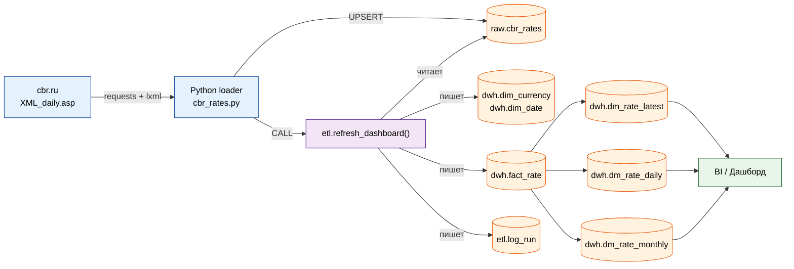
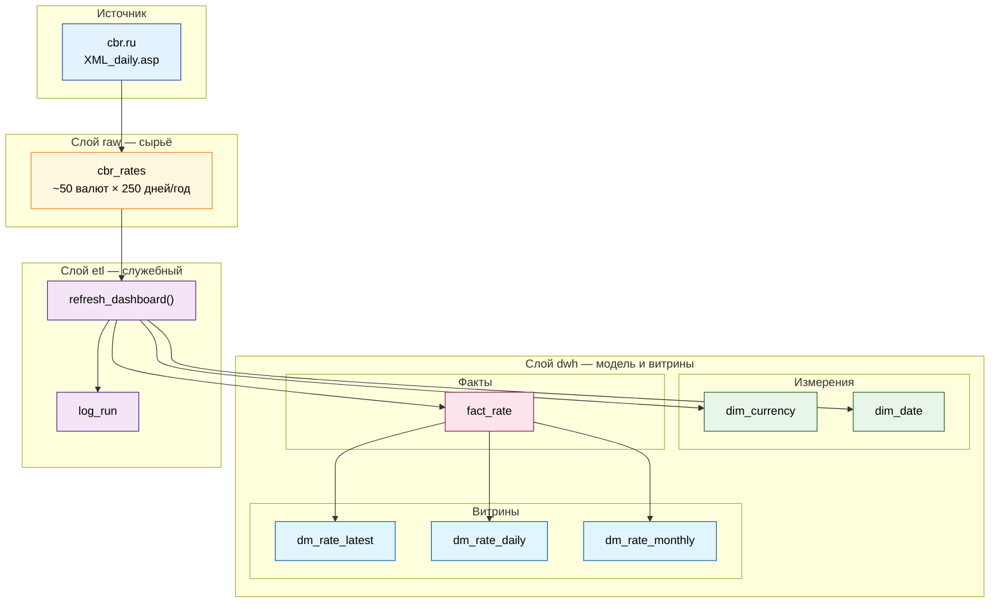
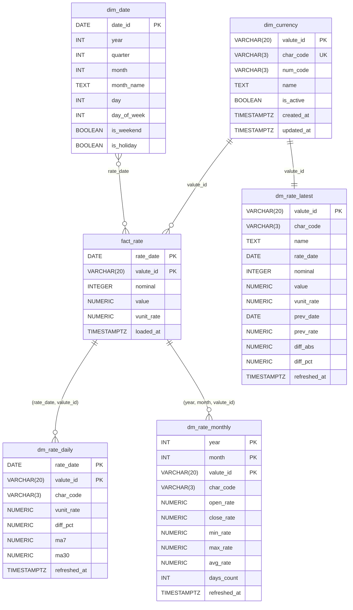
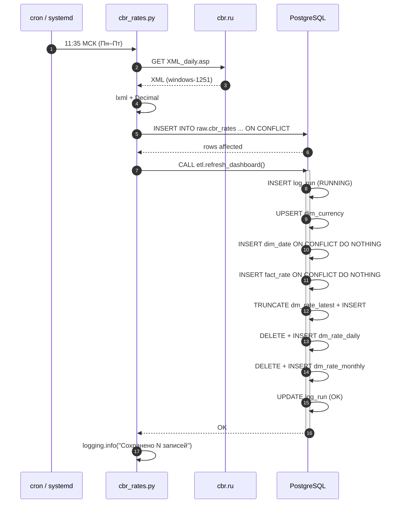

# CBR Rates ETL

[](./README.md)
[](./README.ru.md)

---

[](https://www.python.org/)
[](https://www.postgresql.org/)
[](#лицензия)

ETL-пайплайн для ежедневной загрузки официальных курсов валют с [cbr.ru](https://www.cbr.ru/scripts/XML_daily.asp) в PostgreSQL и построения витрин для BI-дашборда.

---

## Содержание

- [О проекте](#о-проекте)
    - [Бизнес-задача](#бизнес-задача)
    - [Что делает проект](#что-делает-проект)
    - [Кому и зачем это нужно](#кому-и-зачем-это-нужно)
- [Ключевые принципы](#ключевые-принципы)
- [Архитектура](#архитектура)
- [Как устроен ETL-процесс](#как-устроен-etl-процесс)
    - [Extract — получение данных](#extract--получение-данных)
    - [Transform — преобразование](#transform--преобразование)
    - [Load — загрузка](#load--загрузка)
    - [Построение витрин](#построение-витрин)
- [Слои данных](#слои-данных)
- [Модель данных](#модель-данных)
- [Поток данных](#поток-данных)
- [Структура репозитория](#структура-репозитория)
- [Требования](#требования)
- [Установка](#установка)
- [Настройка БД](#настройка-бд)
- [Запуск](#запуск)
- [Примеры запросов](#примеры-запросов)
- [Мониторинг](#мониторинг)
- [Автоматизация](#автоматизация)
- [Обработка сбоев](#обработка-сбоев)
- [Roadmap](#roadmap)
- [Лицензия](#лицензия)
- [Автор](#Контакты)

---

## О проекте

### Бизнес-задача

Компания работает с валютными операциями и регулярно сверяется с **официальными курсами ЦБ РФ**. Курсы публикуются на сайте cbr.ru в виде XML-выгрузки `XML_daily.asp`, которая обновляется один раз в рабочий день. Эта выгрузка — «сырой» формат: одна большая XML-простыня, где каждая валюта описана тегами `<Valute>`, а числа приходят с десятичной запятой и в кодировке windows-1251.

Аналитикам и продукту нужен **стабильный, исторический, нормализованный источник данных**, на который можно положить дашборд: карточки «текущий курс», линейные графики динамики, месячные агрегаты. Прямо тянуть XML из дашборда нельзя — это медленно, ненадёжно, нет истории, нет агрегатов, нет разграничения прав.

### Что делает проект

ETL-пайплайн решает эту задачу end-to-end:

1. **Ежедневно забирает** XML с cbr.ru по расписанию.
2. **Парсит** его в структурированный вид (кодировка, десятичная запятая, вложенные теги).
3. **Складывает сырьё** в PostgreSQL без потерь и без дублей.
4. **Нормализует** данные: справочник валют, календарь, факт-таблица курсов.
5. **Строит витрины** для дашборда: последние курсы, дневную динамику с MA7/MA30, месячные свечи.
6. **Логирует** каждый запуск: статус, время, затронутые строки, ошибки.

### Кому и зачем это нужно

| Роль | Что получает |
|---|---|
| **Аналитик / BI** | Готовые витрины `dm_*` с курсами, дельтами, скользящими средними. Подключается read-only ролью. |
| **Разработчик дашборда** | Стабильные таблицы с фиксированной схемой, не зависящие от формата XML ЦБ. |
| **Дата-инженер** | Прозрачный ETL: `raw → dwh → dm`, журнал запусков, идемпотентность. |
| **DBA** | Чёткое разделение прав: `cbr_loader` пишет, `bi_reader` читает, `public` не используется. |

---

## Ключевые принципы

Проект построен на нескольких базовых принципах, которые объясняют большинство решений в коде.

### 1. Идемпотентность

**Повторный запуск не должен ломать данные.** Если скрипт упадёт и перезапустится, или cron случайно сработает дважды — результат должен быть тем же.

- В `raw.cbr_rates` — `ON CONFLICT (record_date, rate_date, valute_id) DO UPDATE`. Повторная вставка за тот же день обновляет строку, а не создаёт дубль.
- В `dwh.fact_rate` — `ON CONFLICT (rate_date, valute_id) DO NOTHING`. Исторические факты не перетираются.
- Витрины `dm_*` собираются заново из `fact_rate` — они всегда консистентны с фактом.

### 2. Слоистость (raw / dwh / etl)

**Сырьё и бизнес-модель — разные вещи.** Формат XML ЦБ может измениться, добавиться новые поля, поменяться кодировка. Если бизнес-логика лежит прямо на сырье — любое изменение источника ломает всё.

- `raw` — «как пришло из источника». Минимум преобразований, максимум данных.
- `dwh` — нормализованная модель: измерения, факты, витрины. Здесь живёт бизнес-логика.
- `etl` — служебный слой: процедуры, журнал.

Между слоями — только через явные имена схем (`raw.cbr_rates`, `dwh.fact_rate`). Это значит, что процедура ETL не сломается, если кто-то поменяет `search_path` в сессии.

### 3. Точность важнее скорости

Курсы валют — это деньги. Ошибка на 0.0001 рубля может накопиться в отчёте. Поэтому:

- Числа парсятся в `Decimal`, а не в `float`. `float` теряет точность на десятичных дробях.
- В БД используется `NUMERIC(20,6)` для `value` и `NUMERIC(20,8)` для `vunit_rate` — с запасом под любые курсы.
- При парсинге XML десятичная запятая `,` заменяется на точку `.` до конвертации.

### 4. Прозрачность и наблюдаемость

**Если ETL упал — это должно быть видно.** Каждый запуск пишет строку в `etl.log_run`:

- `status = RUNNING` в начале,
- `status = OK` или `status = ERROR` в конце,
- `rows_affected` — JSONB с числом затронутых строк по каждому шагу,
- `error_msg` — текст ошибки, если что-то пошло не так.

Плюс `logging` на стороне Python: тот же статус дублируется в stdout/лог-файл.

### 5. Разделение прав

Загрузчик и BI не должны ходить под одной ролью. `cbr_loader` пишет в `raw` и вызывает ETL. `bi_reader` — только SELECT по витринам. Схема `public` вообще не используется как рабочая.

---

## Архитектура

Проект — это три слоя в одной БД, между которыми данные двигаются в одном направлении.



**Как это читать:**

- Python-загрузчик — единственный компонент, который ходит наружу (в cbr.ru).
- Сырьё падает в `raw.cbr_rates`. Дальше его никто не трогает, кроме ETL-процедуры.
- ETL-процедура — сердце проекта. Она читает `raw`, пишет в `dwh`, обновляет витрины и логирует.
- BI-слой читает только `dm_*` и `dim_*`. К `raw` не имеет доступа.

---

## Как устроен ETL-процесс

ETL — это Extract, Transform, Load. В нашем случае есть ещё четвёртый шаг: построение витрин. Разберём каждый.

### Extract — получение данных

**Источник:** `https://www.cbr.ru/scripts/XML_daily.asp`

**Что это:** XML-документ в кодировке windows-1251, обновляется ЦБ один раз в рабочий день (обычно днём). Структура:

```xml
<ValCurs Date="12.09.2026" name="Foreign Currency Market">
  <Valute ID="R01010">
    <NumCode>036</NumCode>
    <CharCode>AUD</CharCode>
    <Nominal>1</Nominal>
    <Name>Австралийский доллар</Name>
    <Value>60,4290</Value>
    <VunitRate>60,429</VunitRate>
  </Valute>
  ...
</ValCurs>
```

**Особенности источника:**

| Особенность | Как обрабатываем |
|---|---|
| Кодировка windows-1251 | `lxml` читает XML-декларацию и сам декодирует в Unicode |
| Десятичная запятая `60,4290` | `Decimal("60,4290".replace(",", "."))` |
| Неразрывные пробелы в числах | `.replace("\xa0", "")` |
| Дата курса в атрибуте `ValCurs/@Date` | `datetime.strptime(..., "%d.%m.%Y")` |
| Много `<Valute>` подряд | `root.findall("Valute")` |

**Реализация в коде:**
```bash
```python
def fetch_xml(url: str = URL) -> bytes:
    resp = requests.get(url, timeout=30)
    resp.raise_for_status()
    return resp.content
```

`resp.content` (bytes), а не `resp.text` — чтобы не полагаться на charset из HTTP-заголовков, которые у cbr.ru исторически кривые. `lxml` сам разберётся с кодировкой из XML-декларации.
```
### Transform — преобразование

На этом шаге XML превращается в список Python-словарей, готовых к вставке в БД.

**Что делаем:**

1. **Парсим XML** с `recover=True` — если в документе будут мелкие ошибки, парсер их переживёт, а не упадёт.
2. **Извлекаем дату курса** из атрибута `ValCurs/@Date` — это не дата запуска, а дата самого курса (может отличаться, если запускаем позже).
3. **Нормализуем числа** — запятая → точка, пробелы убираем, конвертируем в `Decimal`.
4. **Собираем список словарей** — по одному на валюту.

**Реализация:**
```bash
```python
def parse_rates(xml_bytes: bytes):
    parser = etree.XMLParser(recover=True, resolve_entities=False, no_network=True)
    root = etree.fromstring(xml_bytes, parser=parser)

    date_attr = root.get("Date")
    rate_date = datetime.strptime(date_attr, "%d.%m.%Y").date()

    def text(el, tag):
        node = el.find(tag)
        return node.text.strip() if node is not None and node.text else None

    def to_decimal(s):
        return Decimal(s.replace(",", ".").replace("\xa0", "").strip()) if s else None

    rates = []
    for v in root.findall("Valute"):
        rates.append({
            "valute_id":  v.get("ID"),
            "num_code":   text(v, "NumCode"),
            "char_code":  text(v, "CharCode"),
            "nominal":    int(text(v, "Nominal") or 1),
            "name":       text(v, "Name"),
            "value":      to_decimal(text(v, "Value")),
            "vunit_rate": to_decimal(text(v, "VunitRate")),
        })
    return rate_date, rates
```
```

**Важные детали:**

- `resolve_entities=False` и `no_network=True` — защита от XXE-атак и внешних сущностей. XML ЦБ вряд ли враждебный, но правило хорошего тона.
- `Nominal` может быть `1`, `100`, `1000`. Для DZD и AMD, например, `100`. Это влияет на интерпретацию `Value` — она за `Nominal` единиц, а не за одну.
- `VunitRate` — уже приведённый к «за 1 единицу» курс. Именно его используем для динамики.
```
### Load — загрузка

Сырые данные падают в `raw.cbr_rates`.

**Схема таблицы:**

| Колонка | Тип | Смысл |
|---|---|---|
| `id` | BIGSERIAL PK | Суррогатный ключ |
| `record_date` | DATE NOT NULL | Когда мы записали (дата запуска) |
| `rate_date` | DATE NOT NULL | Дата курса из `ValCurs/@Date` |
| `valute_id` | VARCHAR(20) NOT NULL | Внутренний ID ЦБ, напр. `R01010` |
| `num_code` | VARCHAR(3) | Цифровой код ISO, напр. `036` |
| `char_code` | VARCHAR(3) NOT NULL | Буквенный код, напр. `AUD` |
| `nominal` | INTEGER NOT NULL | Номинал, `1` / `100` / `1000` |
| `name` | TEXT | Название валюты |
| `value` | NUMERIC(20,6) | Курс за `nominal` единиц |
| `vunit_rate` | NUMERIC(20,8) | Курс за 1 единицу |
| `created_at` | TIMESTAMPTZ | Момент вставки |

**Почему две даты:** `record_date` — это «дата загрузки», `rate_date` — «дата курса». Если запустим скрипт в понедельник утром, а ЦБ ещё не обновил курс за понедельник — получим курс за пятницу. Обе даты нужно хранить отдельно, чтобы:

- Видеть, когда именно мы получили эту строку.
- Различать «курс за сегодня» и «курс, который сегодня опубликован».
- Защититься от повторной вставки через `UNIQUE (record_date, rate_date, valute_id)`.

**Реализация — батч-UPSERT:**

```bash
```python
INSERT_SQL = """
    INSERT INTO raw.cbr_rates
        (record_date, rate_date, valute_id, num_code, char_code,
         nominal, name, value, vunit_rate)
    VALUES %s
    ON CONFLICT (record_date, rate_date, valute_id) DO UPDATE SET
        num_code   = EXCLUDED.num_code,
        char_code  = EXCLUDED.char_code,
        nominal    = EXCLUDED.nominal,
        name       = EXCLUDED.name,
        value      = EXCLUDED.value,
        vunit_rate = EXCLUDED.vunit_rate
"""

with conn.cursor() as cur:
    execute_values(cur, INSERT_SQL, rows, page_size=500)
conn.commit()
```

`execute_values` собирает один многострочный `INSERT` — это в разы быстрее, чем по одному `INSERT` на каждую валюту. `page_size=500` — размер батча; для ~50 валют это одна страница, для больших выгрузок — несколько.
```
### Построение витрин

После загрузки сырья вызывается процедура `etl.refresh_dashboard()`. Она делает 6 шагов:

**1. `dim_currency` — справочник валют (SCD1).**

Из сырья берём по одной строке на валюту (`DISTINCT ON (valute_id)`), обновляем имя/коды, если изменились. `ON CONFLICT DO UPDATE` — тип SCD1, где хранится только текущее состояние.

```sql
INSERT INTO dwh.dim_currency (valute_id, char_code, num_code, name, updated_at)
SELECT DISTINCT ON (valute_id)
       valute_id, char_code, num_code, name, now()
FROM raw.cbr_rates
ORDER BY valute_id, rate_date DESC, record_date DESC
ON CONFLICT (valute_id) DO UPDATE
    SET char_code  = EXCLUDED.char_code,
        num_code   = EXCLUDED.num_code,
        name       = EXCLUDED.name,
        updated_at = now();
```

**2. `dim_date` — календарь.**

Заполняется от `p_calendar_from` (по умолчанию 3 года назад) до года вперёд. Содержит год, квартал, месяц, день недели, флаг выходного. `ON CONFLICT DO NOTHING` — если дата уже есть, пропускаем.

**3. `fact_rate` — факты курсов.**

Из `raw.cbr_rates` берём все строки, джойним с `dim_currency` (чтобы отбросить неизвестные валюты), вставляем с `ON CONFLICT (rate_date, valute_id) DO NOTHING`. То есть исторические курсы никогда не перетираются.

```sql
INSERT INTO dwh.fact_rate
    (rate_date, valute_id, nominal, value, vunit_rate, loaded_at)
SELECT r.rate_date, r.valute_id, r.nominal, r.value, r.vunit_rate, now()
FROM raw.cbr_rates r
JOIN dwh.dim_currency c ON c.valute_id = r.valute_id
ON CONFLICT (rate_date, valute_id) DO NOTHING;
```

**4. `dm_rate_latest` — последний курс + дельта.**

Витрина для карточек на дашборде. Для каждой валюты берётся последняя строка и предпоследняя, считается разница в рублях и процентах.

Логика через `ROW_NUMBER()`:

```sql
WITH ranked AS (
    SELECT f.rate_date, f.valute_id, f.vunit_rate,
           ROW_NUMBER() OVER (
               PARTITION BY f.valute_id ORDER BY f.rate_date DESC
           ) AS rn
    FROM dwh.fact_rate f
),
last_two AS (
    SELECT valute_id,
           MAX(CASE WHEN rn = 1 THEN rate_date  END) AS rate_date,
           MAX(CASE WHEN rn = 1 THEN vunit_rate END) AS vunit_rate,
           MAX(CASE WHEN rn = 2 THEN rate_date  END) AS prev_date,
           MAX(CASE WHEN rn = 2 THEN vunit_rate END) AS prev_rate
    FROM ranked
    WHERE rn <= 2
    GROUP BY valute_id
)
...
```

Витрина пересобирается через `TRUNCATE` — таблица крошечная (число валют ≈ 50), пересобрать дешевле, чем ловить все случаи изменения.

**5. `dm_rate_daily` — дневная динамика + MA7/MA30.**

Для графиков. По каждой валюте и дате — курс, процент изменения, скользящие средние за 7 и 30 дней. Окно по умолчанию — 90 дней (`p_daily_days`).

`LAG()` даёт предыдущее значение, `AVG() OVER (... ROWS BETWEEN 6 PRECEDING AND CURRENT ROW)` — MA7. Всё в одном проходе.

```sql
WITH base AS (
    SELECT f.rate_date, f.valute_id, c.char_code, f.vunit_rate,
           LAG(f.vunit_rate) OVER (
               PARTITION BY f.valute_id ORDER BY f.rate_date
           ) AS prev_rate
    FROM dwh.fact_rate f
    JOIN dwh.dim_currency c ON c.valute_id = f.valute_id
    WHERE f.rate_date >= CURRENT_DATE - (p_daily_days || ' days')::interval
),
with_ma AS (
    SELECT b.*,
           AVG(b.vunit_rate) OVER (
               PARTITION BY b.valute_id ORDER BY b.rate_date
               ROWS BETWEEN 6 PRECEDING AND CURRENT ROW
           ) AS ma7,
           AVG(b.vunit_rate) OVER (
               PARTITION BY b.valute_id ORDER BY b.rate_date
               ROWS BETWEEN 29 PRECEDING AND CURRENT ROW
           ) AS ma30
    FROM base b
)
...
```

**6. `dm_rate_monthly` — месячные свечи (OHLC).**

Для графика «свечи» и месячных отчётов. По каждой валюте и месяцу: открытие, закрытие, минимум, максимум, среднее, число дней.

Открытие/закрытие через `ARRAY_AGG` с сортировкой:

```sql
(ARRAY_AGG(vunit_rate ORDER BY rate_date ASC ))[1] AS open_rate,
(ARRAY_AGG(vunit_rate ORDER BY rate_date DESC))[1] AS close_rate
```

Первый элемент массива, отсортированного по возрастанию даты — открытие. По убыванию — закрытие.

**Логирование.** В начале процедуры — `INSERT INTO etl.log_run (..., status='RUNNING')`, в конце — `UPDATE ... status='OK'` с `rows_affected`. При исключении — `UPDATE ... status='ERROR'` с `error_msg` и `RAISE`.

---

## Слои данных



**Что лежит в каждом слое:**

| Слой | Схема | Назначение | Кто пишет | Кто читает |
|---|---|---|---|---|
| Сырьё | `raw` | Данные как пришли из источника | `cbr_loader` | ETL |
| Модель | `dwh` (dim/fact) | Нормализованные измерения и факты | ETL | ETL, аналитики |
| Витрины | `dwh` (dm_*) | Готовые агрегаты для BI | ETL | `bi_reader` |
| Служебный | `etl` | Процедуры, журнал | ETL | DBA, мониторинг |

---

## Модель данных



**Пояснения:**

- `dim_currency` — SCD1 (текущее состояние). Ключ — `valute_id` ЦБ (`R01010`). `char_code` уникален.
- `dim_date` — стандартный календарь. Нужен для агрегатов «по месяцам/кварталам» без `EXTRACT` на больших таблицах.
- `fact_rate` — композитный ключ `(rate_date, valute_id)`. `nominal` храним, потому что `value` — за `nominal` единиц, а не за одну.
- Витрины `dm_*` — денормализованные, без FK, чтобы BI-запросы были максимально простыми.

---

## Поток данных



---

## Структура репозитория

```
cbr-rates-etl/
├── README.md
├── requirements.txt
├── requirements-dev.txt
├── .env.example
├── .gitignore
├── cbr_rates.py                  # основной загрузчик
├── sql/
│   ├── 00_prepare.sql
│   ├── 01_move_cbr_rates.sql
│   ├── 02_dwh_model.sql
│   ├── 03_dwh_marts.sql
│   ├── 04_etl.sql
│   ├── 05_run_and_check.sql
│   └── 06_grants.sql
└── scripts/
    └── cbr-rates.cron
```

---

## Требования

| Компонент | Версия |
|---|---|
| Python | 3.10+ |
| PostgreSQL | 13+ |
| `requests` | 2.31+ |
| `lxml` | 4.9+ |
| `psycopg2-binary` | 2.9+ |

`requirements.txt`:

```txt
requests>=2.31
lxml>=4.9
psycopg2-binary>=2.9
```

`requirements-dev.txt`:

```txt
lxml-stubs
types-requests
types-psycopg2
```

---

## Установка

```bash
git clone https://github.com/<user>/cbr-rates-etl.git
cd cbr-rates-etl

python -m venv .venv
source .venv/bin/activate          # Linux/macOS
.venv\Scripts\activate             # Windows

pip install -r requirements.txt
pip install -r requirements-dev.txt   # опционально
```

Создайте `.env` (см. `.env.example`):

```env
PGHOST=localhost
PGPORT=5432
PGDATABASE=coinlore
PGUSER=postgres
PGPASSWORD=change-me
```

---

## Настройка БД

Все скрипты идемпотентны — их можно применять повторно без риска сломать данные. Порядок важен: `00 → 01 → 02 → 03 → 04 → 06`.

### Шаг 0. Схемы

`sql/00_prepare.sql`:

```sql
CREATE SCHEMA IF NOT EXISTS raw;
CREATE SCHEMA IF NOT EXISTS dwh;
CREATE SCHEMA IF NOT EXISTS etl;

COMMENT ON SCHEMA raw IS 'Сырьё из внешних источников (API ЦБ и т.п.)';
COMMENT ON SCHEMA dwh IS 'Нормализованная модель + витрины для дашборда';
COMMENT ON SCHEMA etl IS 'ETL-процедуры и журнал запусков';
```

### Шаг 1. Перенос сырья в raw

`sql/01_move_cbr_rates.sql`:

```sql
ALTER TABLE public.cbr_rates SET SCHEMA raw;

COMMENT ON TABLE  raw.cbr_rates              IS 'Сырые курсы валют с cbr.ru (XML_daily.asp)';
COMMENT ON COLUMN raw.cbr_rates.record_date  IS 'Дата записи в БД (когда запустили скрипт)';
COMMENT ON COLUMN raw.cbr_rates.rate_date    IS 'Дата курса из атрибута ValCurs/@Date';
COMMENT ON COLUMN raw.cbr_rates.valute_id    IS 'Внутренний ID валюты ЦБ (R01010)';
COMMENT ON COLUMN raw.cbr_rates.num_code     IS 'Цифровой код ISO (036)';
COMMENT ON COLUMN raw.cbr_rates.char_code    IS 'Буквенный код ISO (AUD)';
COMMENT ON COLUMN raw.cbr_rates.nominal      IS 'Номинал (1, 100, 1000)';
COMMENT ON COLUMN raw.cbr_rates.name         IS 'Название валюты';
COMMENT ON COLUMN raw.cbr_rates.value        IS 'Курс за nominal единиц';
COMMENT ON COLUMN raw.cbr_rates.vunit_rate   IS 'Курс за 1 единицу валюты';

CREATE INDEX IF NOT EXISTS idx_cbr_rates_rate_date  ON raw.cbr_rates (rate_date);
CREATE INDEX IF NOT EXISTS idx_cbr_rates_char_code  ON raw.cbr_rates (char_code);
```

Если `public.cbr_rates` ещё нет — создайте её так:

```sql
CREATE TABLE public.cbr_rates (
    id            BIGSERIAL PRIMARY KEY,
    record_date   DATE        NOT NULL,
    rate_date     DATE        NOT NULL,
    valute_id     VARCHAR(20) NOT NULL,
    num_code      VARCHAR(3),
    char_code     VARCHAR(3)  NOT NULL,
    nominal       INTEGER     NOT NULL,
    name          TEXT,
    value         NUMERIC(20,6),
    vunit_rate    NUMERIC(20,8),
    created_at    TIMESTAMPTZ NOT NULL DEFAULT now(),
    CONSTRAINT uq_cbr_rates UNIQUE (record_date, rate_date, valute_id)
);
```

### Шаг 2. Нормализованная модель dwh

`sql/02_dwh_model.sql`:

```sql
CREATE TABLE IF NOT EXISTS dwh.dim_currency (
    valute_id    VARCHAR(20) PRIMARY KEY,
    char_code    VARCHAR(3)  NOT NULL,
    num_code     VARCHAR(3),
    name         TEXT,
    is_active    BOOLEAN     NOT NULL DEFAULT TRUE,
    created_at   TIMESTAMPTZ NOT NULL DEFAULT now(),
    updated_at   TIMESTAMPTZ NOT NULL DEFAULT now()
);
CREATE UNIQUE INDEX IF NOT EXISTS uq_dim_currency_char_code
    ON dwh.dim_currency (char_code);
CREATE INDEX IF NOT EXISTS idx_dim_currency_num_code
    ON dwh.dim_currency (num_code);

CREATE TABLE IF NOT EXISTS dwh.dim_date (
    date_id      DATE PRIMARY KEY,
    year         INT  NOT NULL,
    quarter      INT  NOT NULL,
    month        INT  NOT NULL,
    month_name   TEXT NOT NULL,
    day          INT  NOT NULL,
    day_of_week  INT  NOT NULL,
    is_weekend   BOOLEAN NOT NULL,
    is_holiday   BOOLEAN NOT NULL DEFAULT FALSE
);
CREATE INDEX IF NOT EXISTS idx_dim_date_ym ON dwh.dim_date (year, month);

CREATE TABLE IF NOT EXISTS dwh.fact_rate (
    rate_date    DATE        NOT NULL,
    valute_id    VARCHAR(20) NOT NULL,
    nominal      INTEGER     NOT NULL,
    value        NUMERIC(20,6) NOT NULL,
    vunit_rate   NUMERIC(20,8) NOT NULL,
    loaded_at    TIMESTAMPTZ NOT NULL DEFAULT now(),
    PRIMARY KEY (rate_date, valute_id),
    CONSTRAINT fk_fact_rate_currency
        FOREIGN KEY (valute_id) REFERENCES dwh.dim_currency (valute_id)
);
CREATE INDEX IF NOT EXISTS idx_fact_rate_valute_date
    ON dwh.fact_rate (valute_id, rate_date DESC);
CREATE INDEX IF NOT EXISTS idx_fact_rate_date
    ON dwh.fact_rate (rate_date);
```

### Шаг 3. Витрины для дашборда

`sql/03_dwh_marts.sql`:

```sql
CREATE TABLE IF NOT EXISTS dwh.dm_rate_latest (
    valute_id    VARCHAR(20) PRIMARY KEY,
    char_code    VARCHAR(3)  NOT NULL,
    name         TEXT,
    rate_date    DATE        NOT NULL,
    nominal      INTEGER     NOT NULL,
    value        NUMERIC(20,6) NOT NULL,
    vunit_rate   NUMERIC(20,8) NOT NULL,
    prev_date    DATE,
    prev_rate    NUMERIC(20,8),
    diff_abs     NUMERIC(20,8),
    diff_pct     NUMERIC(10,4),
    refreshed_at TIMESTAMPTZ NOT NULL DEFAULT now()
);

CREATE TABLE IF NOT EXISTS dwh.dm_rate_daily (
    rate_date    DATE        NOT NULL,
    valute_id    VARCHAR(20) NOT NULL,
    char_code    VARCHAR(3)  NOT NULL,
    vunit_rate   NUMERIC(20,8) NOT NULL,
    diff_pct     NUMERIC(10,4),
    ma7          NUMERIC(20,8),
    ma30         NUMERIC(20,8),
    refreshed_at TIMESTAMPTZ NOT NULL DEFAULT now(),
    PRIMARY KEY (rate_date, valute_id)
);
CREATE INDEX IF NOT EXISTS idx_dm_rate_daily_char_date
    ON dwh.dm_rate_daily (char_code, rate_date DESC);

CREATE TABLE IF NOT EXISTS dwh.dm_rate_monthly (
    year         INT         NOT NULL,
    month        INT         NOT NULL,
    valute_id    VARCHAR(20) NOT NULL,
    char_code    VARCHAR(3)  NOT NULL,
    open_rate    NUMERIC(20,8) NOT NULL,
    close_rate   NUMERIC(20,8) NOT NULL,
    min_rate     NUMERIC(20,8) NOT NULL,
    max_rate     NUMERIC(20,8) NOT NULL,
    avg_rate     NUMERIC(20,8) NOT NULL,
    days_count   INT         NOT NULL,
    refreshed_at TIMESTAMPTZ NOT NULL DEFAULT now(),
    PRIMARY KEY (year, month, valute_id)
);
```

### Шаг 4. Процедура ETL и журнал

`sql/04_etl.sql` — см. полный текст в [Приложении A](#приложение-a-полный-текст-sqletlsql). Ключевые объекты:

- `etl.log_run` — журнал запусков.
- `etl.refresh_dashboard(p_calendar_from, p_daily_days, p_monthly_from)` — процедура пересборки витрин.

### Шаг 5. Права доступа

`sql/06_grants.sql`:

```sql
GRANT USAGE ON SCHEMA raw, dwh, etl TO cbr_loader;
GRANT SELECT, INSERT, UPDATE ON raw.cbr_rates TO cbr_loader;
GRANT USAGE, SELECT ON ALL SEQUENCES IN SCHEMA raw TO cbr_loader;
GRANT EXECUTE ON PROCEDURE etl.refresh_dashboard(DATE, INT, DATE) TO cbr_loader;

GRANT USAGE ON SCHEMA dwh TO bi_reader;
GRANT SELECT ON dwh.dm_rate_latest,
                dwh.dm_rate_daily,
                dwh.dm_rate_monthly,
                dwh.dim_currency,
                dwh.dim_date
    TO bi_reader;

ALTER DEFAULT PRIVILEGES IN SCHEMA dwh
    GRANT SELECT ON TABLES TO bi_reader;

ALTER DATABASE coinlore SET search_path TO raw, dwh, etl, public;
```

Проверка:

```sql
CALL etl.refresh_dashboard();
SELECT * FROM etl.log_run ORDER BY id DESC LIMIT 5;
```

---

## Запуск

```bash
python cbr_rates.py
```

**Что происходит по шагам:**

1. `requests.get` тянет `XML_daily.asp`.
2. `lxml` парсит XML, кодировка windows-1251 → Unicode.
3. Числа с запятой → `Decimal`.
4. `execute_values` делает батч-UPSERT в `raw.cbr_rates`.
5. `CALL etl.refresh_dashboard()` пересобирает витрины.
6. В `etl.log_run` пишется статус.
7. В stdout — лог через `logging`.

**Кастомные окна пересборки:**

```python
import psycopg2
from cbr_rates import DB_CONFIG

with psycopg2.connect(**DB_CONFIG) as conn:
    with conn.cursor() as cur:
        cur.execute("CALL etl.refresh_dashboard(%s, %s, %s)",
                    ('2020-01-01', 365, '2023-01-01'))
    conn.commit()
```

---

## Примеры запросов

**Топ-5 изменений за день:**

```sql
SELECT char_code, name, rate_date, vunit_rate, diff_abs, diff_pct
FROM dwh.dm_rate_latest
ORDER BY ABS(diff_pct) DESC NULLS LAST
LIMIT 5;
```

**Динамика USD/EUR за 90 дней:**

```sql
SELECT rate_date, char_code, vunit_rate, ma7, ma30
FROM dwh.dm_rate_daily
WHERE char_code IN ('USD','EUR')
ORDER BY rate_date;
```

**Средний курс USD по месяцам:**

```sql
SELECT d.year, d.month, d.month_name,
       ROUND(AVG(f.vunit_rate), 4) AS avg_rate
FROM dwh.fact_rate f
JOIN dwh.dim_date     d ON d.date_id  = f.rate_date
JOIN dwh.dim_currency c ON c.valute_id = f.valute_id
WHERE c.char_code = 'USD'
GROUP BY d.year, d.month, d.month_name
ORDER BY d.year, d.month;
```

**Свечи по EUR за последние 12 месяцев:**

```sql
SELECT year, month, open_rate, close_rate, min_rate, max_rate, avg_rate
FROM dwh.dm_rate_monthly
WHERE char_code = 'EUR'
ORDER BY year DESC, month DESC
LIMIT 12;
```

---

## Мониторинг

**Последние запуски:**

```sql
SELECT id, started_at, finished_at,
       finished_at - started_at AS duration,
       status, rows_affected, error_msg
FROM etl.log_run
ORDER BY id DESC
LIMIT 10;
```

**Ошибки за сутки:**

```sql
SELECT *
FROM etl.log_run
WHERE status = 'ERROR'
  AND started_at >= now() - INTERVAL '24 hours'
ORDER BY started_at DESC;
```

**Проверка идемпотентности:**

```sql
SELECT COUNT(*) AS total,
       COUNT(DISTINCT (rate_date, valute_id)) AS distinct_keys
FROM dwh.fact_rate;
-- числа должны совпадать
```

**Свежесть данных:**

```sql
SELECT MAX(rate_date) AS last_rate_date,
       MAX(loaded_at) AS last_loaded_at,
       now() - MAX(loaded_at) AS age
FROM dwh.fact_rate;
```

---

## Автоматизация

`scripts/cbr-rates.cron`:

```cron
# Пн–Пт, 11:35 МСК. ЦБ не публикует курс в выходные.
CRON_TZ=Europe/Moscow
35 11 * * 1-5 /usr/bin/python3 /opt/cbr-rates-etl/cbr_rates.py >> /var/log/cbr-rates.log 2>&1
```

**systemd timer** (рекомендуется для прод-серверов):

`/etc/systemd/system/cbr-rates.service`:

```ini
[Unit]
Description=CBR rates ETL
After=network-online.target

[Service]
Type=oneshot
WorkingDirectory=/opt/cbr-rates-etl
EnvironmentFile=/opt/cbr-rates-etl/.env
ExecStart=/opt/cbr-rates-etl/.venv/bin/python /opt/cbr-rates-etl/cbr_rates.py
User=cbr
```

`/etc/systemd/system/cbr-rates.timer`:

```ini
[Unit]
Description=Run CBR rates ETL daily

[Timer]
OnCalendar=Mon..Fri 11:35 Europe/Moscow
Persistent=true

[Install]
WantedBy=timers.target
```

```bash
systemctl enable --now cbr-rates.timer
systemctl list-timers | grep cbr
```

`Persistent=true` — если сервер был выключен в момент срабатывания, timer догонит пропущенный запуск при загрузке.

---

## Обработка сбоев

| Ситуация | Что произойдёт | Что делать |
|---|---|---|
| cbr.ru недоступен | `requests.exceptions.ConnectionError`, скрипт падает, `log_run` не пишется | Проверить сеть, повторить запуск. Ретраи — в roadmap. |
| cbr.ru вернул 5xx | `raise_for_status()` бросает исключение | То же. Ретраи — в roadmap. |
| XML битый | `lxml` с `recover=True` попробует спасти; если не выйдет — исключение | Смотреть лог, проверить ответ cbr.ru. |
| БД недоступна | `psycopg2.OperationalError` | Проверить сервис, креды. |
| Процедура ETL упала | `log_run` получит `status='ERROR'` и `error_msg`, транзакция откатится | `SELECT * FROM etl.log_run WHERE status='ERROR' ORDER BY id DESC LIMIT 1;` |
| Повторный запуск за день | `raw.cbr_rates` — UPSERT, `fact_rate` — DO NOTHING, `dm_*` — пересборка | Ничего, всё идемпотентно. |

**Проверка, что всё хорошо:**

```sql
SELECT status, COUNT(*)
FROM etl.log_run
WHERE started_at >= now() - INTERVAL '7 days'
GROUP BY status;
```

Если в `ERROR` больше 0 за неделю — надо разбираться.

---

## Roadmap

- [ ] Ретраи с экспоненциальным backoff на `requests`.
- [ ] Метрика `today_already_loaded` — пропуск повторной загрузки, если курс уже есть.
- [ ] Уведомления в Telegram/Slack при `status='ERROR'`.
- [ ] `dbt`-модели поверх `dwh` для аналитики.
- [ ] Grafana dashboard на основе `dm_rate_daily`.
- [ ] Оформление миграций в Flyway/Liquibase.
- [ ] Партиционирование `fact_rate` по годам (если объём вырастет).

---

## Лицензия

MIT. См. `LICENSE`.
### Контакты
* Email: sergeyh510@gmail.com
* GitHub: sergeyh510-alt
* LinkedIn: www.linkedin.com/in/sergey-chekryzhov-a38778217
* Telegram: @SergeyChekryzhov
